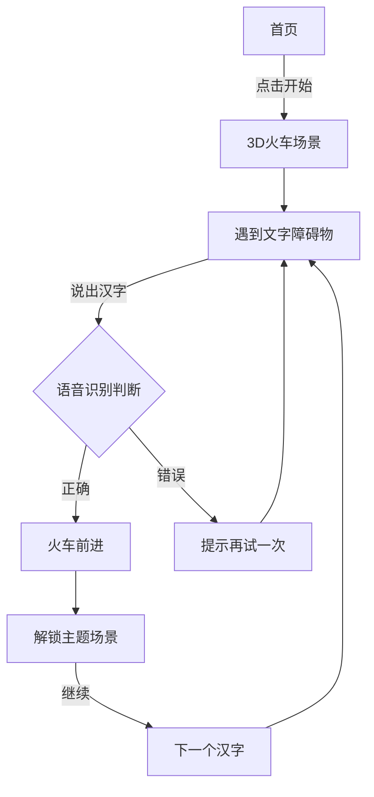

## 1. 产品概览
这是一款面向3-6岁儿童的3D文字学习游戏，通过有趣的小火车冒险场景，让小朋友通过语音识别学习常用汉字。
- 沉浸式3D游戏体验，增强学习趣味性
- 语音识别技术，实现自然的交互方式
- 分场景渐进式学习，培养持续学习动力
- 电视投屏支持，提供家庭共同学习场景

## 2. 核心功能

### 2.1 用户角色
| 角色 | 注册方式 | 角色权限 |
|------|---------|---------|
| 小朋友 | 无需注册 | 游戏游玩、学习汉字、解锁新场景 |

### 2.2 功能模块
我们的文字学习游戏包含以下主要页面：
1. **首页**：开始游戏入口、场景选择、设置页面入口
2. **游戏页**：3D火车场景、文字障碍物、语音识别交互
3. **场景页**：每个汉字对应一个主题场景，展示相关内容

### 2.3 页面详情
| 页面名称 | 模块名称 | 功能描述 |
|---------|---------|---------|
| 首页 | 开始游戏 | 点击进入游戏主场景 |
| 首页 | 场景选择 | 查看已解锁场景，快速进入 |
| 首页 | 设置 | 调整音量、语言、投屏设置 |
| 游戏页 | 3D火车场景 | 展示行驶的小火车和轨道 |
| 游戏页 | 文字障碍物 | 3D立体汉字挡在轨道上 |
| 游戏页 | 语音识别 | 监听用户发音，判断是否正确 |
| 游戏页 | 反馈系统 | 正确/错误时的视觉和音效反馈 |
| 游戏页 | 火车移动 | 答对后火车驶过障碍物 |
| 场景页 | 主题场景 | 展示与当前汉字相关的图像和内容 |
| 场景页 | 继续按钮 | 点击进入下一个汉字学习 |

## 3. 核心流程
用户从首页开始游戏 → 进入3D场景看到小火车 → 遇到文字障碍物 → 说出汉字名称 → 系统判断正确 → 火车继续前进 → 解锁对应场景 → 学习下一个汉字。

## 4. 用户界面设计
### 4.1 设计风格
- **主色调**：明亮活泼的儿童色彩（天蓝色、草绿色、阳光黄、草莓红）
- **视觉风格**：卡通化、圆润可爱的3D风格
- **字体**：圆润清晰的无衬线字体，确保小朋友易于辨认
- **交互**：大按钮、明显动画反馈，简单直观

### 4.2 页面设计概览
| 页面名称 | 模块名称 | UI元素 |
|---------|---------|-------|
| 首页 | 整体布局 | 蓝天白云背景，彩色云朵按钮，圆润可爱的图标 |
| 首页 | 开始游戏按钮 | 大尺寸火车图标按钮，鲜艳的红色/黄色渐变 |
| 游戏页 | 3D场景 | 绿色草地、蓝色天空、彩色轨道、可爱小火车 |
| 游戏页 | 文字障碍物 | 3D立体汉字，带有发光边框 |
| 游戏页 | 反馈提示 | 星星爆炸动画、欢呼音效、彩色烟花 |
| 场景页 | 主题展示 | 与汉字相关的3D模型或插画，色彩丰富 |

### 4.3 自适应
- 电视投屏优先设计，界面元素大而清晰
- 支持平板和手机端适配
- 触摸操作友好，大点击区域
