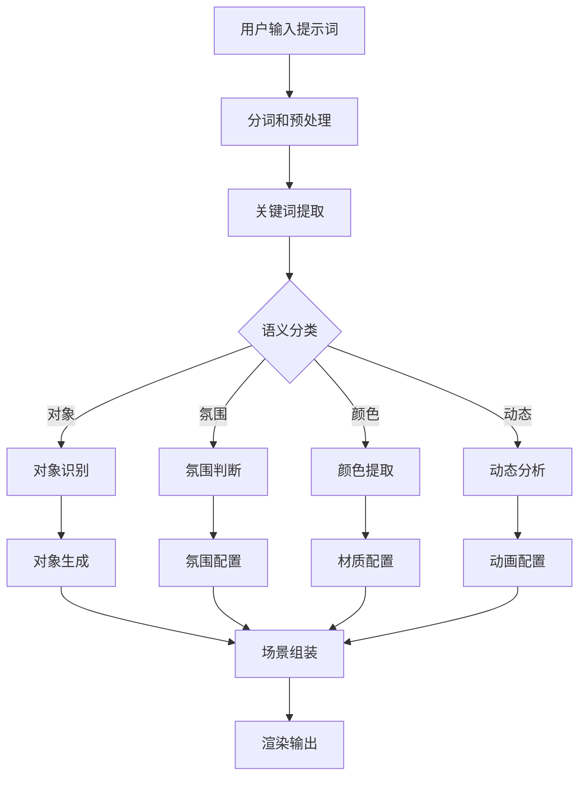

# DreamScape 3D - 技术架构文档

## 1. 系统架构概述

### 1.1 整体架构图

```
┌──────────────────────────────────────────────────────────────┐
│                        用户界面层 (UI Layer)                  │
│  React + Tailwind CSS + Framer Motion                        │
│  - AI 提示词输入组件                                           │
│  - 3D 场景展示区                                               │
│  - 控制面板                                                    │
│  - 场景信息展示                                                │
└──────────────────────────────────────────────────────────────┘
                              │
                              ▼
┌──────────────────────────────────────────────────────────────┐
│                     业务逻辑层 (Business Layer)                │
│  React Hooks + Zustand State Management                       │
│  - SceneManager: 场景状态管理                                  │
│  - PromptProcessor: AI 提示词处理器                            │
│  - ElementGenerator: 场景元素生成器                            │
│  - InteractionController: 交互控制器                           │
└──────────────────────────────────────────────────────────────┘
                              │
                              ▼
┌──────────────────────────────────────────────────────────────┐
│                    3D 渲染引擎层 (Rendering Engine)             │
│  Three.js + @react-three/fiber + @react-three/drei            │
│  - 场景图管理 (Scene Graph)                                    │
│  - 相机控制 (Camera Controls)                                  │
│  - 光照系统 (Lighting System)                                 │
│  - 材质系统 (Material System)                                  │
│  - 粒子系统 (Particle System)                                  │
│  - 后处理效果 (Post-processing)                               │
└──────────────────────────────────────────────────────────────┘
                              │
                              ▼
┌──────────────────────────────────────────────────────────────┐
│                   AI 场景生成层 (AI Scene Generation)           │
│  规则引擎 + 语义解析                                            │
│  - PromptParser: 自然语言解析                                  │
│  - ElementSelector: 元素选择器                                │
│  - StyleMapper: 风格映射器                                    │
│  - AnimationBuilder: 动画构建器                               │
└──────────────────────────────────────────────────────────────┘
```

---

## 2. 核心模块设计

### 2.1 AI 提示词处理器 (PromptProcessor)

#### 职责
- 解析用户输入的自然语言
- 提取关键词和语义信息
- 识别场景元素类型
- 判断场景氛围和风格

#### 输入输出
```typescript
// 输入
interface PromptInput {
  text: string;  // 用户输入的提示词
  language: 'zh' | 'en';
}

// 输出
interface ParsedPrompt {
  keywords: string[];           // 提取的关键词
  objects: SceneObject[];        // 识别出的对象
  mood: SceneMood;              // 场景氛围
  style: SceneStyle;            // 场景风格
  colors: string[];             // 颜色关键词
  lighting: LightingPreference; // 光照偏好
  motion: MotionType[];         // 动态元素
}
```

#### 解析策略

1. **分词处理**
   - 中文：基于 jieba 分词库
   - 英文：基于空格和标点分词
   - 提取名词、形容词、动词

2. **语义分类**
   ```
   对象类: 山、水、树、建筑、人物、动物、飞船、星球...
   氛围词: 神秘、宁静、热烈、黑暗、空灵、赛博朋克...
   颜色词: 红色、蓝色、金色、银色、霓虹、渐变...
   动态词: 旋转、漂浮、闪烁、流动、爆炸、收缩...
   材质词: 金属、玻璃、水晶、毛绒、木质、透明...
   ```

3. **场景模式匹配**
   - 预设 20+ 经典场景模板
   - 关键词匹配度计算
   - 最优模板选择

### 2.2 场景元素生成器 (ElementGenerator)

#### 功能
- 根据解析结果生成 3D 对象
- 组合几何体创建复杂形状
- 应用材质和纹理
- 添加动态效果

#### 对象类型库

```typescript
// 基础几何体
const GEOMETRIES = {
  // 几何形状
  sphere: { type: 'SphereGeometry', params: [1, 32, 32] },
  cube: { type: 'BoxGeometry', params: [1, 1, 1] },
  cone: { type: 'ConeGeometry', params: [1, 2, 32] },
  cylinder: { type: 'CylinderGeometry', params: [1, 1, 2, 32] },
  torus: { type: 'TorusGeometry', params: [1, 0.4, 16, 100] },
  torusKnot: { type: 'TorusKnotGeometry', params: [1, 0.4, 128, 32] },
  octahedron: { type: 'OctahedronGeometry', params: [1, 0] },
  icosahedron: { type: 'IcosahedronGeometry', params: [1, 0] },
  dodecahedron: { type: 'DodecahedronGeometry', params: [1, 0] },
  tetrahedron: { type: 'TetrahedronGeometry', params: [1, 0] },
  plane: { type: 'PlaneGeometry', params: [10, 10] },
  
  // 特殊形状
  star: { type: 'CustomStar' },  // 自定义星星形状
  crystal: { type: 'CrystalShape' }, // 自定义水晶形状
  nebula: { type: 'NebulaCloud' },  // 星云效果
};
```

#### 材质库

```typescript
const MATERIALS = {
  // 基础材质
  metal: {
    type: 'MeshStandardMaterial',
    metalness: 0.9,
    roughness: 0.1,
  },
  glass: {
    type: 'MeshPhysicalMaterial',
    transmission: 0.95,
    thickness: 1.5,
    ior: 1.5,
  },
  crystal: {
    type: 'MeshPhysicalMaterial',
    transmission: 0.9,
    thickness: 2,
    ior: 2.4,
    iridescence: 1,
  },
  neon: {
    type: 'MeshBasicMaterial',
    emissiveIntensity: 2,
  },
  hologram: {
    type: 'ShaderMaterial',
    transparent: true,
    opacity: 0.6,
  },
};
```

#### 生成算法

```typescript
class ElementGenerator {
  // 主生成方法
  generateFromPrompt(prompt: ParsedPrompt): SceneElement[] {
    const elements: SceneElement[] = [];
    
    // 1. 生成核心对象
    for (const obj of prompt.objects) {
      const element = this.createObject(obj);
      elements.push(element);
    }
    
    // 2. 生成环境元素
    const envElements = this.createEnvironment(prompt.mood);
    elements.push(...envElements);
    
    // 3. 添加氛围粒子
    const particles = this.createParticles(prompt.mood, prompt.motion);
    elements.push(...particles);
    
    // 4. 添加动态效果
    this.addAnimations(elements, prompt.motion);
    
    return elements;
  }
  
  // 对象创建
  private createObject(obj: SceneObject): SceneElement {
    const geometry = this.selectGeometry(obj.type);
    const material = this.selectMaterial(obj.material || 'default');
    const position = this.calculatePosition(obj.importance);
    
    return {
      id: generateId(),
      geometry,
      material,
      position,
      rotation: obj.rotation || [0, 0, 0],
      scale: this.calculateScale(obj.size),
      animation: this.selectAnimation(obj.motion),
    };
  }
}
```

### 2.3 粒子系统 (ParticleSystem)

#### 功能
- 创建氛围粒子效果
- 支持多种粒子形态
- 自定义粒子运动轨迹
- 性能优化处理

#### 粒子类型

```typescript
const PARTICLE_TYPES = {
  stars: {
    count: 1000,
    size: 0.05,
    color: '#ffffff',
    movement: 'twinkle',
  },
  fireflies: {
    count: 100,
    size: 0.1,
    color: '#ffff00',
    movement: 'float',
  },
  snow: {
    count: 500,
    size: 0.08,
    color: '#ffffff',
    movement: 'fall',
  },
  rain: {
    count: 1000,
    size: 0.02,
    color: '#88ccff',
    movement: 'fall',
  },
  petals: {
    count: 200,
    size: 0.15,
    color: '#ff69b4',
    movement: 'float',
  },
  embers: {
    count: 300,
    size: 0.08,
    color: '#ff4500',
    movement: 'rise',
  },
  magic: {
    count: 500,
    size: 0.12,
    color: '#da70d6',
    movement: 'spiral',
  },
  dust: {
    count: 800,
    size: 0.03,
    color: '#d2b48c',
    movement: 'drift',
  },
};
```

### 2.4 光照系统 (LightingSystem)

#### 光照预设

```typescript
const LIGHTING_PRESETS = {
  ethereal: {
    ambient: { intensity: 0.3, color: '#8866aa' },
    directional: { intensity: 0.8, color: '#ffffff', position: [5, 10, 5] },
    point: [
      { intensity: 1, color: '#ff69b4', position: [-3, 2, 2] },
      { intensity: 0.8, color: '#00ffff', position: [3, 2, -2] },
    ],
  },
  cyberpunk: {
    ambient: { intensity: 0.2, color: '#000033' },
    directional: { intensity: 0.5, color: '#ff0066', position: [10, 10, 5] },
    point: [
      { intensity: 2, color: '#00ffff', position: [-5, 3, 3] },
      { intensity: 2, color: '#ff00ff', position: [5, 3, -3] },
    ],
  },
  sunset: {
    ambient: { intensity: 0.4, color: '#ff7f50' },
    directional: { intensity: 1, color: '#ff6347', position: [10, 5, 0] },
    point: [],
  },
  night: {
    ambient: { intensity: 0.1, color: '#000022' },
    directional: { intensity: 0.3, color: '#4444ff', position: [5, 10, 5] },
    point: [
      { intensity: 1.5, color: '#ffffff', position: [0, 5, 0] },
    ],
  },
};
```

---

## 3. 渲染管线

### 3.1 渲染流程

```
用户输入提示词
      ↓
AI 解析处理 (PromptProcessor)
      ↓
场景元素生成 (ElementGenerator)
      ↓
构建 3D 场景对象
      ↓
Three.js 场景图构建
      ↓
应用光照和材质
      ↓
粒子系统初始化
      ↓
相机和控制器设置
      ↓
后处理效果应用
      ↓
渲染循环启动
      ↓
实时交互响应
```

### 3.2 后处理管线

```typescript
const postProcessing = {
  bloom: {
    intensity: 1.5,
    luminanceThreshold: 0.6,
    luminanceSmoothing: 0.9,
  },
  vignette: {
    offset: 1.3,
    darkness: 1.2,
  },
  colorCorrection: {
    exposure: 1.1,
    brightness: 0.05,
    contrast: 1.1,
  },
};
```

---

## 4. 状态管理

### 4.1 Zustand Store 结构

```typescript
interface AppState {
  // 场景状态
  scene: {
    elements: SceneElement[];
    lighting: LightingConfig;
    atmosphere: AtmosphereConfig;
    camera: CameraConfig;
    isGenerating: boolean;
  };
  
  // UI 状态
  ui: {
    promptInput: string;
    history: string[];
    activePreset: string | null;
    showInfo: boolean;
    autoRotate: boolean;
  };
  
  // 性能状态
  performance: {
    fps: number;
    quality: 'low' | 'medium' | 'high';
    particleCount: number;
  };
}
```

### 4.2 状态更新流程

```
用户操作
    ↓
Dispatch Action
    ↓
Zustand Store 更新
    ↓
订阅组件重新渲染
    ↓
Three.js 场景同步更新
```

---

## 5. 性能优化策略

### 5.1 渲染优化

#### LOD (Level of Detail) 系统
```typescript
const LOD_LEVELS = {
  high: { distance: 0, quality: 1.0 },
  medium: { distance: 50, quality: 0.6 },
  low: { distance: 100, quality: 0.3 },
};
```

#### 对象池技术
- 预创建常用几何体实例
- 对象复用减少 GC 压力
- 动态调整对象数量

#### 粒子系统优化
- 使用 InstancedMesh
- 视锥剔除
- 距离衰减

### 5.2 资源管理

```typescript
class ResourceManager {
  private cache: Map<string, any>;
  private loading: Map<string, Promise<any>>;
  
  async loadTexture(url: string): Promise<THREE.Texture> {
    if (this.cache.has(url)) {
      return this.cache.get(url);
    }
    if (this.loading.has(url)) {
      return this.loading.get(url);
    }
    
    const promise = this.loadTextureAsync(url);
    this.loading.set(url, promise);
    const texture = await promise;
    this.cache.set(url, texture);
    this.loading.delete(url);
    return texture;
  }
}
```

---

## 6. 文件结构

```
/workspace/
├── index.html
├── package.json
├── vite.config.js
├── tailwind.config.js
├── postcss.config.js
├── .gitignore
├── README.md
├── public/
│   └── favicon.ico
└── src/
    ├── main.jsx                 # 应用入口
    ├── App.jsx                  # 主应用组件
    ├── index.css                # 全局样式
    ├── stores/
    │   └── useStore.js          # Zustand 状态管理
    ├── components/
    │   ├── Scene.jsx            # 3D 场景组件
    │   ├── PromptInput.jsx      # AI 提示词输入
    │   ├── ControlPanel.jsx     # 控制面板
    │   └── InfoOverlay.jsx      # 信息展示层
    ├── three/
    │   ├── SceneManager.js      # 场景管理器
    │   ├── ElementFactory.js    # 元素工厂
    │   ├── ParticleSystem.js    # 粒子系统
    │   └── LightingSystem.js    # 光照系统
    ├── ai/
    │   ├── PromptParser.js       # 提示词解析器
    │   ├── SceneGenerator.js    # 场景生成器
    │   └── AnimationBuilder.js  # 动画构建器
    └── utils/
        ├── constants.js        # 常量定义
        └── helpers.js          # 工具函数
```

---

## 7. 关键技术实现

### 7.1 AI 场景生成流程



### 7.2 核心算法

#### 提示词相似度计算
```typescript
function calculateSimilarity(prompt: string, template: string): number {
  const promptWords = tokenize(prompt);
  const templateWords = tokenize(template);
  
  const intersection = promptWords.filter(w => templateWords.includes(w));
  const union = [...new Set([...promptWords, ...templateWords])];
  
  return intersection.length / union.length;
}
```

#### 智能位置分配
```typescript
function distributeObjects(count: number, radius: number): Vector3[] {
  const positions: Vector3[] = [];
  const goldenAngle = Math.PI * (3 - Math.sqrt(5));
  
  for (let i = 0; i < count; i++) {
    const y = 1 - (i / (count - 1)) * 2;
    const radiusAtY = Math.sqrt(1 - y * y);
    const theta = goldenAngle * i;
    
    positions.push(new Vector3(
      Math.cos(theta) * radiusAtY * radius,
      y * radius,
      Math.sin(theta) * radiusAtY * radius
    ));
  }
  
  return positions;
}
```

---

## 8. 浏览器兼容性

### 8.1 WebGL 特性检测

```typescript
function checkWebGLSupport(): { supported: boolean; version: number } {
  try {
    const canvas = document.createElement('canvas');
    const gl = canvas.getContext('webgl2');
    return { supported: !!gl, version: gl ? 2 : 1 };
  } catch (e) {
    return { supported: false, version: 0 };
  }
}
```

### 8.2 Fallback 策略

- WebGL 2.0 不支持：降级到 WebGL 1.0
- WebGL 完全不支持：显示静态背景图 + 提示信息
- 性能不足：自动降低渲染质量

---

## 9. 部署架构

### 9.1 开发环境
```
本地开发服务器: Vite Dev Server
端口: 5173
热重载: 启用
```

### 9.2 生产环境
```
构建工具: Vite Build
输出目录: dist/
代码分割: 启用
压缩: 启用
CDN: 可选
```

### 9.3 性能监控
```
FPS 监控: 实时显示
内存使用: 监控警告
错误追踪: Console 监控
```

---

## 10. 未来扩展方向

### 10.1 AI 集成
- 集成 OpenAI GPT API 进行更智能的场景理解
- 使用 DALL-E 生成纹理贴图
- 语音输入支持

### 10.2 社交功能
- 场景分享
- 用户创作展示
- 社区互动

### 10.3 高级功能
- VR/AR 支持
- 场景导出 (GLTF)
- 多人协作编辑

---

## 11. 测试计划

### 11.1 单元测试
- PromptParser 解析准确性
- ElementGenerator 对象生成
- 动画系统正常运行

### 11.2 集成测试
- 完整场景生成流程
- 用户交互响应
- 状态管理正确性

### 11.3 性能测试
- 不同复杂度场景帧率
- 内存泄漏检测
- 大规模粒子性能

---

## 12. 开发时间估算

| 阶段 | 任务 | 时间 |
|------|------|------|
| 第一周 | 项目搭建、基础架构 | 5天 |
| 第二周 | 3D 渲染引擎核心 | 5天 |
| 第三周 | AI 场景生成逻辑 | 5天 |
| 第四周 | UI 界面和交互 | 5天 |
| 第五周 | 优化和测试 | 5天 |
| 总计 | 完整产品 | 25天 |

---

## 13. 风险评估

| 风险项 | 影响 | 缓解措施 |
|--------|------|----------|
| WebGL 性能问题 | 高 | LOD 系统、质量降级 |
| AI 解析不准确 | 中 | 规则引擎优化、人工标注 |
| 浏览器兼容性问题 | 中 | 多版本测试、Fallback |
| 移动端体验差 | 低 | 响应式设计、性能优化 |
